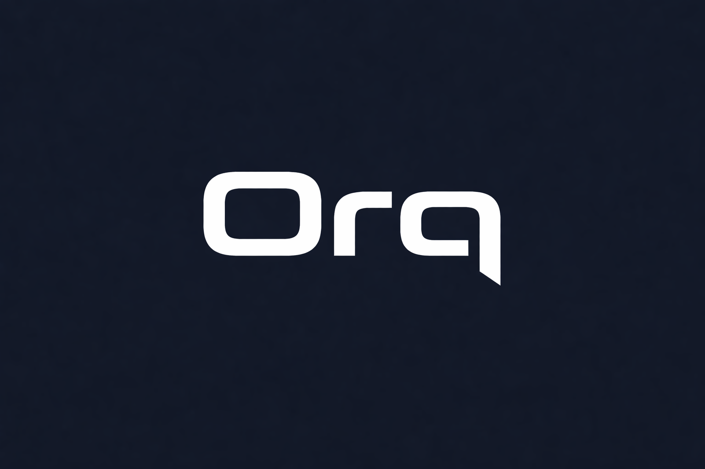

# Orq

<p align="center">
  
</p>

Orq is an **agentic AI workspace** that connects multiple AI services into one room-based interface. Instead of switching between tools, type `@` in any room and Orq routes your request to the right system.

**Built for the Llama Lounge Hackathon at Snowflake (Agentic AI theme).**

---

## Sponsor Integrations

| Integration | What It Does | Trigger |
|------------|-------------|---------|
| **CrewAI** | Multi-agent orchestration -- AI agents collaborate on complex tasks | `@crew` or `@orq` |
| **Composio** | Connects to real Gmail, Google Docs, and Google Drive via OAuth | `@action` or `@orq` |
| **Snowflake Cortex** | NLP functions -- sentiment analysis, translation, summarization | `@data` or `@orq` |
| **Skyfire** | AI-native payment protocol -- pay-per-query LLM access and tokens | `@pay` or `@orq` |

---

## How It Works

1. **Rooms** -- Create rooms for different contexts (team, personal, project)
2. **@ Mentions** -- Type `@` in any room to see an autocomplete dropdown with AI commands
3. **Auto-routing** -- Use `@orq` for auto-detection or specific triggers (`@crew`, `@action`, `@data`, `@pay`, `@summary`)
4. **Activity** -- Every AI action is logged to a shared Activity panel

### @ Commands

| Trigger | What It Does |
|---------|-------------|
| `@orq` | AI auto-detects intent and routes to the right service |
| `@crew` | Multi-agent task (CrewAI) |
| `@action` | Gmail, Docs, Drive actions (Composio) |
| `@data` | Sentiment, Translate, Summarize (Snowflake Cortex) |
| `@pay` | Payments & tokens (Skyfire) |
| `@summary` | Quick summarization (Cortex) |

---

## Tech Stack

| Layer | Technology |
|-------|-----------|
| Frontend | React 19 + Vite + Framer Motion |
| Backend | FastAPI (Python) + SQLAlchemy + SQLite |
| Agents | CrewAI (multi-agent orchestration) |
| Tools | Composio (Gmail, Google Docs, Drive) |
| Data | Snowflake + Cortex AI |
| Payments | Skyfire (AI-native payment protocol) |
| Auth | JWT cookie-based sessions |

---

## Quick Start

### 1. Backend

```bash
cd backend
python -m venv venv
venv\Scripts\activate        # Windows
# source venv/bin/activate   # Mac/Linux
pip install -r requirements.txt
```

Create a `.env` file in `backend/` (see API Keys section below), then:

```bash
python seed.py               # creates demo accounts + rooms
uvicorn main:app --reload    # starts on http://localhost:8000
```

### 2. Frontend

```bash
cd frontend
npm install
npm run dev                  # starts on http://localhost:5173
```

### 3. Login

Open **http://localhost:5173** and log in:

| Name | Email | Password |
|------|-------|----------|
| Sean | sean@orq.dev | pass |
| Yug | yug@orq.dev | pass |

### 4. Test It

- **Type `@` in the chat input** -- autocomplete dropdown should appear
- **`@orq what is agentic AI?`** -- general AI chat (auto-classified)
- **`@crew Research the latest trends in agentic AI`** -- launches CrewAI multi-agent task
- **`@action Check my latest emails`** -- reads Gmail via Composio
- **`@data Analyze sentiment: I love this product!`** -- Snowflake Cortex NLP
- **`@pay Check my Skyfire balance`** -- Skyfire payment status
- **`@summary Summarize: [paste text]`** -- Cortex summarization
- **Click "+ New Room"** -- create rooms and invite members
- **Plain messages (no @)** -- team chat visible to room members

---

## API Keys (.env)

Create `backend/.env` with:

```env
OPENAI_API_KEY=sk-...
COMPOSIO_API_KEY=...
SNOWFLAKE_ACCOUNT=...
SNOWFLAKE_USER=...
SNOWFLAKE_PASSWORD=...
SKYFIRE_API_KEY=...
JWT_SECRET=any-random-string
```

| Service | Get Key |
|---------|---------|
| OpenAI | [platform.openai.com](https://platform.openai.com) |
| Composio | [composio.dev](https://composio.dev) |
| Snowflake | [go.dataops.live/llama-lounge-hackathon](https://go.dataops.live/llama-lounge-hackathon) |
| Skyfire | [skyfire.xyz](https://skyfire.xyz) |

---

## Seed Rooms

Running `python seed.py` creates:

| Room | Members | GitHub Repo |
|------|---------|-------------|
| Orq Team | Sean + Yug | SeanAminov/Orq |
| Sean & Yug | Sean + Yug | -- |
| Sean's Workspace | Sean only | -- |
| Yug's Workspace | Yug only | -- |

---

## Project Structure

```
backend/
  main.py          # FastAPI app (all endpoints + AI routing)
  models.py        # SQLAlchemy models (User, Room, Message, AgentRun)
  seed.py          # DB seeding (accounts + rooms)
  config.py        # Lazy singletons (OpenAI, Composio, Snowflake, Skyfire)
  crew.py          # CrewAI general crew (3 agents)
  candidate_crew.py # Candidate research crew (5 agents)
  digest_crew.py   # Commit digest crew (3 agents)
  github_tools.py  # GitHub REST API tools
  database.py      # SQLAlchemy engine + session

frontend/
  src/
    pages/         # Landing, Login, Signup, Dashboard
    components/    # ChatPanel, RoomSidebar, ActivityPanel, DocsPanel, etc.
    styles/        # CSS (dashboard, theme)
    context/       # ThemeContext
```

---

## Team

**Sean Aminov** & **Yug More**
